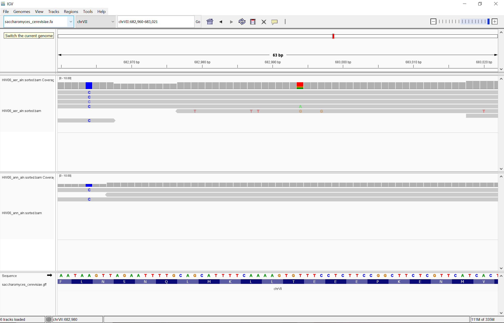

# Week 6 Homework Assignment
## Sub-sampling the first 100,000 reads from each set into a new file
```bash
seqkit head -n 100000 file name > new file

seqkit head -n 100000 SF_aer_R1.fq.gz > ~/OMICS/wk06/reads/SF_aer_R1_100K.fq.gz
seqkit head -n 100000 SF_ann_R1.fq.gz > ~/OMICS/wk06/reads/SF_ann_R1_100K.fq.gz
seqkit head -n 100000 SF_ann_R2.fq.gz > ~/OMICS/wk06/reads/SF_ann_R2_100K.fq.gz
seqkit head -n 100000 SF_aer_R2.fq.gz > ~/OMICS/wk06/reads/SF_aer_R2_100K.fq.gz
```

## Indexing the reference genome
```bash
bwa index reference.fa

bwa index refs/saccharomyces_cerevisiae.fa
```

## Aligning the reads to the SGD reference
```bash
bwa mem reference.fa read_R1.fq.gz read_R2.fq.gz > newfilename.sam

bwa mem refs/saccharomyces_cerevisiae.fa reads/SF_aer_R1_100K.fq.gz reads/SF_aer_R2_100K.fq.gz  > aln/HW06_aer_aln.sam
bwa mem refs/saccharomyces_cerevisiae.fa reads/SF_ann_R1_100K.fq.gz reads/SF_ann_R2_100K.fq.gz > aln/HW06_ann_aln.sam
```

## Changing from .sam to .bam file 
```bash
samtools view -b filename.sam > filename.bam

samtools view -b aln/HW06_aer_aln.sam > aln/HW06_aer_aln.bam
samtools view -b aln/HW06_ann_aln.sam > aln/HW06_ann_aln.bam
```

## Sorting the reads
```bash
samtools sort aln/HW06_aer_aln.sam > aln/HW06_aer_aln.sorted.bam
samtools sort aln/HW06_ann_aln.bam > aln/HW06_ann_aln.sorted.bam
```

## Using samtools view to determine how many reads aligned from each sample at a Q30 threshold. 
```bash
samtools view -q 30 -c aln/HW06_aer_aln.sorted.bam
samtools view -q 30 -c aln/HW06_ann_aln.sorted.bam
```
|          | Aer      | Ann      |
|:---------|:---------|:---------|
| # reads  | 185103   | 184978   |

## Determining the average depth across each chromosome in each sample.
```bash
samtools depth -r chrI aln/HW06_aer_aln.sorted.bam | awk '{sum+=$3; count++} END {if (count>0) print sum/count; else print "No data"}'
samtools depth -r chrI aln/HW06_ann_aln.sorted.bam | awk '{sum+=$3; count++} END {if (count>0) print sum/count; else print "No data"}'
```
Did this for every chromosome for each sample and put into the table below:

|   | ChrI | ChrII | ChrIII | Chr IV | ChrV | ChrVI | ChrVII | ChrVIII | ChrIX | ChrX | ChrXI | ChrXII | ChrXIII | ChrXIV | ChrXV | ChrXVI |
|---|------|-------|--------|--------|------|-------|--------|---------|-------|------|-------|--------|---------|--------|-------|--------|
|aer|3.66855|2.82507|3.19126|2.60359|2.99737|3.3676|3.28045|2.89715|3.47094|2.79502|2.90822|3.03549|2.7546|2.83804|2.7793|2.75876|
|ann|2.96831|2.82478|2.89845|2.78312|3.04038|3.37869|2.76491|3.29766|3.40055|2.93878|2.87083|3.41843|2.77465|3.27894|2.86569|2.81457|


## Indexing the reads
```bash
samtools index aln/HW06_aer_aln.sorted.bam
samtools index aln/HW06_ann_aln.sorted.bam
```

## IGV
Downloaded the files (sample.bam, sample.bam.bai,ref.fa, ref.fa.fai, ref.gff) to my personal pc and opened in IGV
Find a region where there seems to be an animo acid change between the samples.


