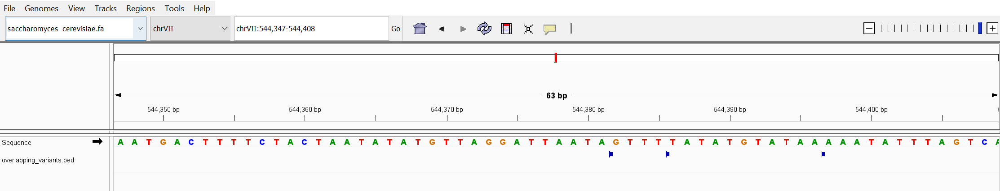

# Week 9 Homework using pipeline to make BCF files and variant calling:

## Using pipeline to create bcf files for the 3 strains from chromosome VII
```bash
bcftools mpileup -r chrVII -Ou -f /data/share/refs/SGD/saccharomyces_cerevisiae.fa /data/share/OMICS/wk06/alns/OGstrain.sorted.bam | bcftools call --ploidy 1 -mv -Ob -o OG_calls.bcf
bcftools mpileup -r chrVII -Ou -f /data/share/refs/SGD/saccharomyces_cerevisiae.fa /data/share/OMICS/wk06/alns/SF_aer.sorted.bam | bcftools call --ploidy 1 -mv -Ob -o SF_aer_calls.bcf
bcftools mpileup -r chrVII -Ou -f /data/share/refs/SGD/saccharomyces_cerevisiae.fa /data/share/OMICS/wk06/alns/SF_ann.sorted.bam | bcftools call --ploidy 1 -mv -Ob -o SF_ann_calls.bcf
```

## indexing/merging bcf files and using bcf fools isec to find variants unique to each of the 3 strains
```bash
bcftools index OG_calls.bcf
bcftools index SF_ann_calls.bcf
bcftools index SF_aer_calls.bcf
bcftools merge -o merged.bcf -O b OG_calls.bcf SF_ann_calls.bcf SF_aer_calls.bcf
bcftools index merged.bcf
bcftools isec -n-1 -c all merged.bcf -O z -p ~/share/vr433/wk09/wk09HW/
```
## bedtools to find the unique variants that overlap with regions defined in /share/refs/SGD/saccharomyces_cerevisiae.gff.
turn saccharomyces_cerevisiae.gff to saccharomyces_cerevisiae.bed, turned 0000.vcf.gz to a unique_variants.bed, and used bedtools intersect to find unique variants that overlap with the regions defined in the saccharomyces_cerevisiae.bed file.
```bash
awk 'BEGIN {FS="\t"; OFS="\t"} {if ($3 == "gene") print $1, $4-1, $5, $9}' ~/share/refs/SGD/saccharomyces_cerevisiae.gff > saccharomyces_cerevisiae.bed
bcftools query -f '%CHROM\t%POS\t%POS\t%ID\n' isec_output/0000.vcf.gz > unique_variants.bed
bedtools intersect -a unique_variants.bed -b saccharomyces_cerevisiae.bed -wa -u > overlapping_variants.bed
```

## Visualizing a selection of them in IGV


