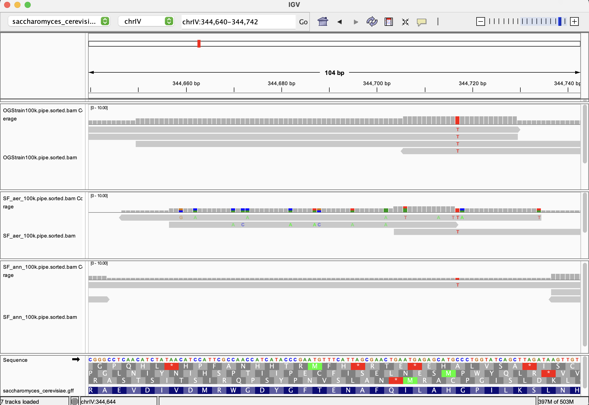

**Week 6 Homework**

First I copied the data from the shared/OMICS directory into my shared/rs3772 directory. Then, I trimmed to the first 100k reads using 

  seqkit head -n 100000 OGstrain_R1.fq.gz -o OGstrain_R1_100k.fq.gz
  seqkit head -n 100000 OGstrain_R2.fq.gz -o OGstrain_R2_100k.fq.gz
  seqkit head -n 100000 SF_aer_R1.fq.gz -o SF_aer_R1_100k.fq.gz 
  seqkit head -n 100000 SF_aer_R2.fq.gz -o SF_aer_R2_100k.fq.gz 
  seqkit head -n 100000 SF_ann_R2.fq.gz -o SF_ann_R2_100k.fq.gz 
  seqkit head -n 100000 SF_ann_R1.fq.gz -o SF_ann_R1_100k.fq.gz 
  
After trimming, it is time to align them to the reference and sort. I decided to go off of what we did in class and do it all in one step using
  
  bwa mem references/saccharomyces_cerevisiae.fa reads/OGstrain_R1_100k.fq.gz reads/OGstrain_R2_100k.fq.gz | samtools sort > aligns/OGStrain100k.pipe.sorted.bam
  bwa mem references/saccharomyces_cerevisiae.fa reads/SF_ann_R1_100k.fq.gz reads/SF_ann_R2_100k.fq.gz | samtools sort > aligns/SF_ann_100k.pipe.sorted.bam
  bwa mem references/saccharomyces_cerevisiae.fa reads/SF_aer_R1_100k.fq.gz reads/SF_aer_R2_100k.fq.gz | samtools sort > aligns/SF_aer_100k.pipe.sorted.bam
  
Next I determined the number of reads that aligned at the q30 threshold using

  samtools view -c -q 30 aligns/OGStrain100k.pipe.sorted.bam 
  samtools view -c -q 30 aligns/SF_ann_100k.pipe.sorted.bam 
  samtools view -c -q 30 aligns/SF_aer_100k.pipe.sorted.bam 

And ended up with 
| OG Strain | SF Anaerobic | SF Aerobic |
|---|---|---|
|182307|184978|185103|

Then I calculated the average depth for each chromosome using 

  samtools depth -r chrI aligns/OGStrain100k.pipe.sorted.bam | awk '{sum+=$3; count++} END {if (count>0) print sum/count; else print "No data"}'
 
And got the following results

|---|I|II|III|IV|V|VI|VII|VIII|IX|X|XI|XII|XIII|XIV|XV|XVI|
|---|---|---|---|---|---|---|---|---|---|---|---|---|---|---|---|---|
|OG Strain|3.32419|2.79851|3.08801|2.70478|2.92396|3.17634|2.72655|2.95757|2.94986|2.89173|2.83491|4.14875|2.77689|2.9069|2.76928|2.80833|
|Anaerobic|2.96831|2.82478|2.89845|2.78312|3.04038|3.37869|2.76491|3.29766|3.40055|2.93878|2.87083|3.41843|2.77465|3.27894|2.86569|2.81457|
|Aerobic|3.66855|2.82507|3.19126|2.60359|2.99737|3.3676|3.28045|2.89715|3.47094|2.79502|2.90822|3.03549|2.7546|2.83804|2.7793|2.75876|

Upon entering IGV, I found a mutation from the reference spread across all three samples in the rad59 gene on chromosome IV. There is a C->T mutation across all three samples as well as the aerobic sample containing many more mutations than either the OG or the anaerobic. Rad59 is a protein involved in double stranded DNA repair and can repair DNA during vegetative growth via recombination and single strand annealing (https://www.yeastgenome.org/locus/S000002217)

