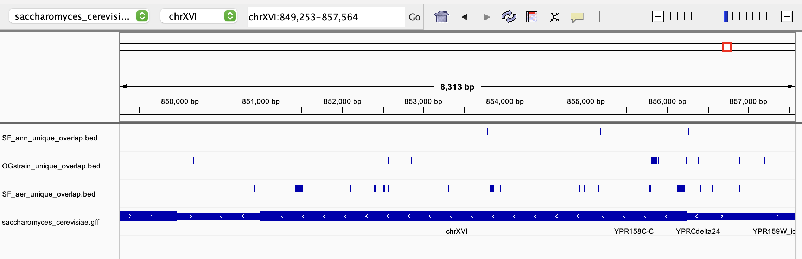

Week 09 Homework

First I slightly modified the variant_pipeline.sh so I can call just chromosome xvi in the bcf file. Since there are only three samples I just called each sample separately instead of making a for loop in the pipeline
Here is my new pipeline:

#!/bin/bash

FILTER='DP>=10&&QUAL>20'

REF=/data/share/refs/SGD/saccharomyces_cerevisiae.fa

(bcftools mpileup -r chrXVI -Ou -f $REF $1 |
  bcftools call -m |         
  bcftools filter -Ob -i $FILTER > $2)

This left me with three bcf files for chromosome xvi, one for each of the three samples, by running the following

sh variant_pipeline.sh ~/share/OMICS/wk06/alns/SF_aer.sorted.bam SF_aer.bcf
sh variant_pipeline.sh ~/share/OMICS/wk06/alns/SF_ann.sorted.bam SF_ann.bcf
sh variant_pipeline.sh ~/share/OMICS/wk06/alns/OGstrain.sorted.bam OGstrain.bcf

Then I indexed these bcf files using bcftools index FILENAME.bcf
 
 
Next, I used bcftools isec to get unique variants in each sample

bcftools isec -n=1 -p ./ SF_aer.bcf SF_ann.bcf OGstrain.bcf

mv 0000.vcf SF_aer_unique.vcf
mv 0001.vcf SF_ann_unique.vcf
mv 0002.vcf OGstrain_unique.vcf

Both finding unique variants and renaming output files so they make sense

After this I converted my vcf files to bed files and then used bedtools intersect to find intersecting variants

GFF=~/share/refs/SGD/saccharomyces_cerevisiae.gff
for file in SF_aer_unique.vcf SF_ann_unique.vcf OGstrain_unique.vcf; do

  bed_file="${file%.vcf}.bed"
  bcftools query -f '%CHROM\t%POS0\t%POS\n' "$file" > "$bed_file"
  

  output_file="${file%.vcf}_overlap.bed"
  bedtools intersect -a "$bed_file" -b "$GFF" > "$output_file"
done

Finally, I downloaded the unique variant bed files and viewed them in IGV. Attached below is a subsection of the variants called

