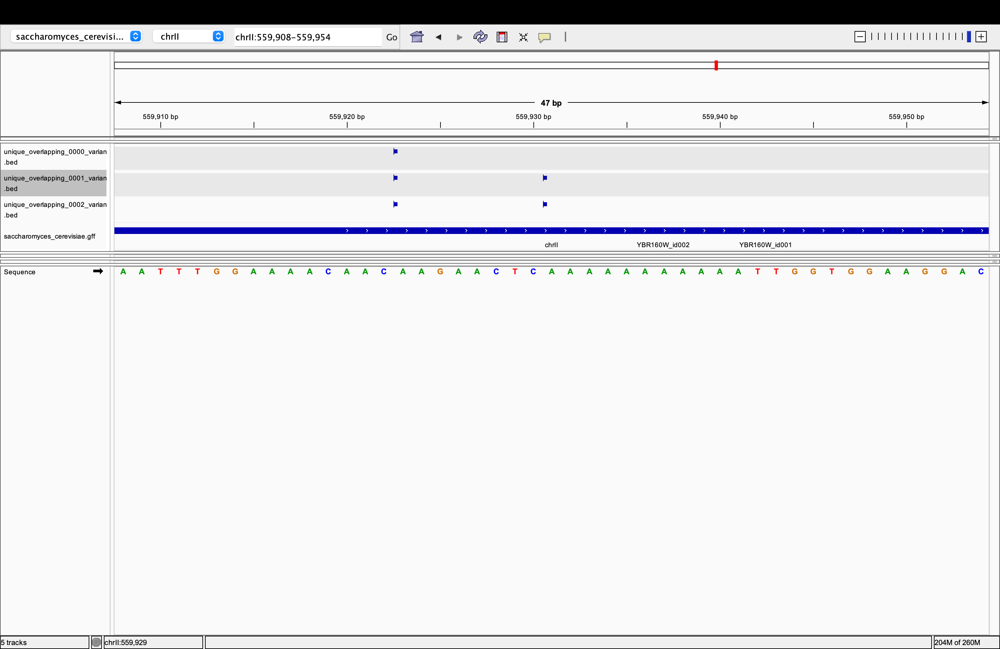

Exercise 

1. Used the pipeline to create bcf files using the following commands:for chromosome II 

$ sh ~/scratch/wk09/variant_pipeline.shell /data/share/OMICS/wk06/alns/OGstrain.sorted.bam OGstrain_calls.bcf

$ sh ~/scratch/wk09/variant_pipeline.shell /data/share/OMICS/wk06/alns/SF_aer.sorted.bam SF_aer_calls.bcf

$ sh ~/scratch/wk09/variant_pipeline.shell /data/share/OMICS/wk06/alns/SF_ann.sorted.bam SF_ann_calls.bcf

- Generated .vcf files 

$ bcftools view -O z -o OGstrain_calls.vcf.gz OGstrain_calls.bcf

$ bcftools view -O z -o SF_aer_calls.vcf.gz SF_aer_calls.bcf

$ bcftools view -O z -o SF_ann_calls.vcf.gz SF_ann_calls.bcf

2. Used bcftools isec to find variants that are unique to each of the three strains 

$ bcftools isec -p output_dir OGstrain_calls.vcf.gz SF_aer_calls.vcf.gz SF_ann_calls.vcf.gz

- this generates a directory with the following files containing variants unique to each of the strains:

-- output_dir/0000.vcf	for stripped	OGstrain_calls.vcf.gz

-- output_dir/0001.vcf	for stripped	SF_aer_calls.vcf.gz

-- output_dir/0002.vcf	for stripped	SF_ann_calls.vcf.gz

```python
3. Used bedtools to find the unique variants that overlap with regions defined in /share/refs/SGD/saccharomyces_cerevisiae.gff.

- to generate .bed files 

$ bcftools query -f '%CHROM\t%POS\t%POS\t%ID\n' output_dir/0000.vcf > 0000_variants.bed

$ bcftools query -f '%CHROM\t%POS\t%POS\t%ID\n' output_dir/0001.vcf > 0001_variants.bed

$ bcftools query -f '%CHROM\t%POS\t%POS\t%ID\n' output_dir/0002.vcf > 0002_variants.bed

- convert .gff file to .bed

$ bedtools sort -i ~/share/refs/SGD/saccharomyces_cerevisiae.gff > regions.bed

- used bedtools intersect to identify overlapping regions 

$ bedtools intersect -a 0000_variants.bed -b regions.bed -wa -u > unique_overlapping_0000_variants.bed

$ bedtools intersect -a 0001_variants.bed -b regions.bed -wa -u > unique_overlapping_0001_variants.bed

$ bedtools intersect -a 0002_variants.bed -b regions.bed -wa -u > unique_overlapping_0002_variants.bed

4. Visualized selection of unique, overlapping variants.

```



```python

```
